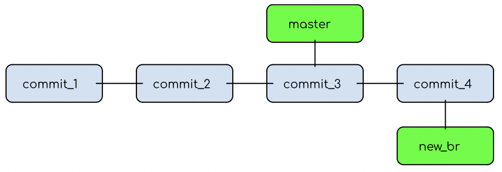
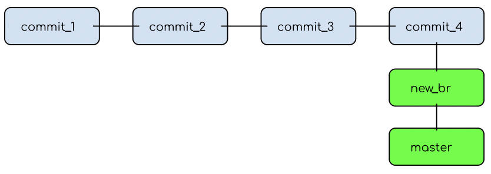
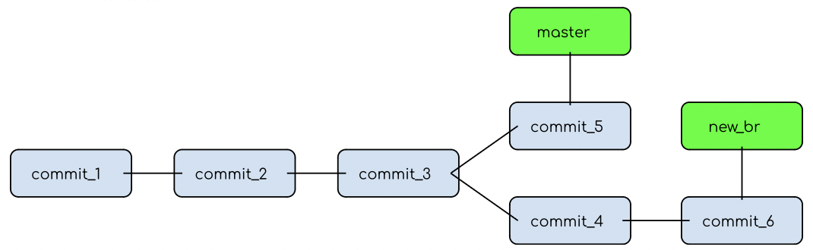
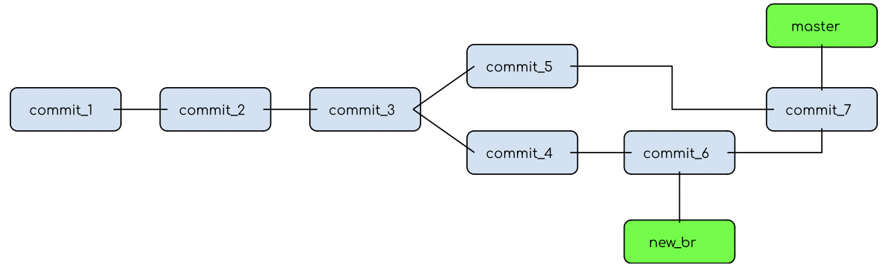
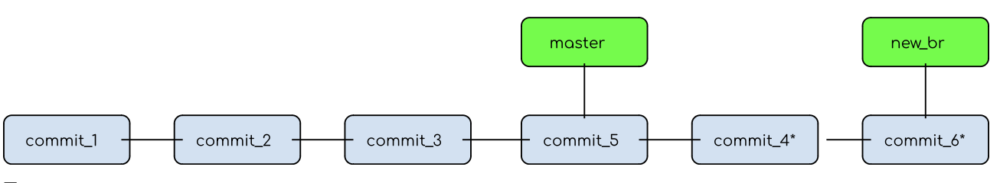

Балабанова_Ксения_БПМ_22_1_v240111_17 

Git - ветвления, функционал

Что такое ветвление?

Ветвления - инструмент, позволяющий отклонится от основной линии разработки и продолжить работу независимо от нее (параллельно).
Ветвление помогают разделять рабочий процесс, оптимизировать тестирование и написание нового кода. Часто используется при командной разработке.

Ветвления реализованы во многих VCS (CVS), но из-за способа хранения информации (снимки, а не изменения в файле) ветвления в Git выделяются среди оставльных (проще и быстрее). 

Ветвление и Git

В понимании разработчика, ветка представляет независимую последовательность коммитов, расположенных в хронологическом порядке, содержащих указатель на предыдущий (родительский) коммит. У первоначального коммита отсутствует родитель, у простого коммита один родитель, несколько родителей для результатов слияния веток.

По реализации, ветка в Git -  перемещаемый указатель на последний коммит. При создании новой ветки - создается новый указатель.
По умолчанию основной веткой проекта является master, по функционалу она ничем не отличается от других, ее просто принято считать главной.

В Git есть специальный указатель HEAD, который указывает на текущую локальную ветку, благодаря этому Git определяет в какой ветке находится пользователь.

Основной функционал работы с ветвлениями

Получение информации о структуре проекта:

`$ git branch //без параметров выводит на экран список существующих веток (обычно ветка, в которой находится пользователь отмечена знаком *)`

`$ git log //выводит журнал изменений`

Для команды `git log` существует множество ключей, которые используются для получения более конкретной информации об изменениях: `-all`, `-n=<...>`, `-p`, `-graph`, `-decorate`.

`$ git status //просмотреть файлы, расположенные в ветке, где находится пользователь`

Добавление веток:

`$ git branch <name> // добавление ветки без перехода на нее`

`$ git checkout <name> //смещение указателя HEAD`

`$ git checkout branch <name>  //создание ветки и смещение указателя`

Команду `checkout` можно использовать с ключами: `-b`.

Нельзя переключаться между ветками, если изменения не сохранены.

Удаление веток:

`$ git branch -d <name>`

Для успешного удаления необходимо соблюдать несколько правил: нельзя удалить ветку, в которой находится HEAD, нельзя удалить ветку с неслитыми изменениями (если это необходимо нужно использовать `-D`).

Независимая работа с отдельными частями кода предполагает дальнейшее слияние их в единый проект. Механизм слияния в Git предполагает перенос изменений с одной ветки на другую, при этом ветвь, сливаемая в основную, остается неизменной. При переходе между ветками до слияния Git возвращает состояние рабочего каталога к тому виду, какой он имел в момент последнего изменения в переключаемую ветвь.

Слияние веток:

`$ git merge <name>`

Эта операция может приводить к большему кол-ву ошибок, например, если в двух сливаемых ветках по-разному изменен один и тот же файл.

Для контроля и исправления ошибок используются следующие команды:

`$ git diff <file1> <file2>// показывает разницу между коммитами`

`$ git merge -abort //прерывает слияние и возвращает первоначальную версию`

`$ git merge -continue // продолжает слияние после разрешения конфликта()`

Тонкости слияния

При простом слияние подразумевает что основная ветка заканчивается там, где начинается новая

В этой ситуации слияние заключается в переносе указателя ветки master. Это называется “fast-forward” (прямой наследник)

Слияние будет идти иначе в ситуации, когда конец ветки master и начало ветки new_br не совпадают

В этой ситуации будет создан коммит слияния, который содержит двух родителей

Пример конфликта для этой ситуации: в ветках master и new_br изменен один и тот же файл (commit_5 и commit_6). В этом случае коммит слияния не будет создан. Команда $git status покажет все неразрешенные конфликты как unmerge. Git добавит маркеры конфликта в эти файлы.

Перебазирование

Второй способ перенести изменения с одной ветки на другую (применяется вместо сложного слияния)

`$ git checkout new_br`

`$ git rebase master`

Ветка, в которой находится пользователь, перемещается (перебазируется) поверх другой. 

Далее осуществляется простое слияние.

Перебазирование и слияние дают одинаковый результат, разница только в истории (перебазирование выглядит чище, чем сложное слияние)

Источники: 

Git -> documentation -> book (https://git-scm.com)

